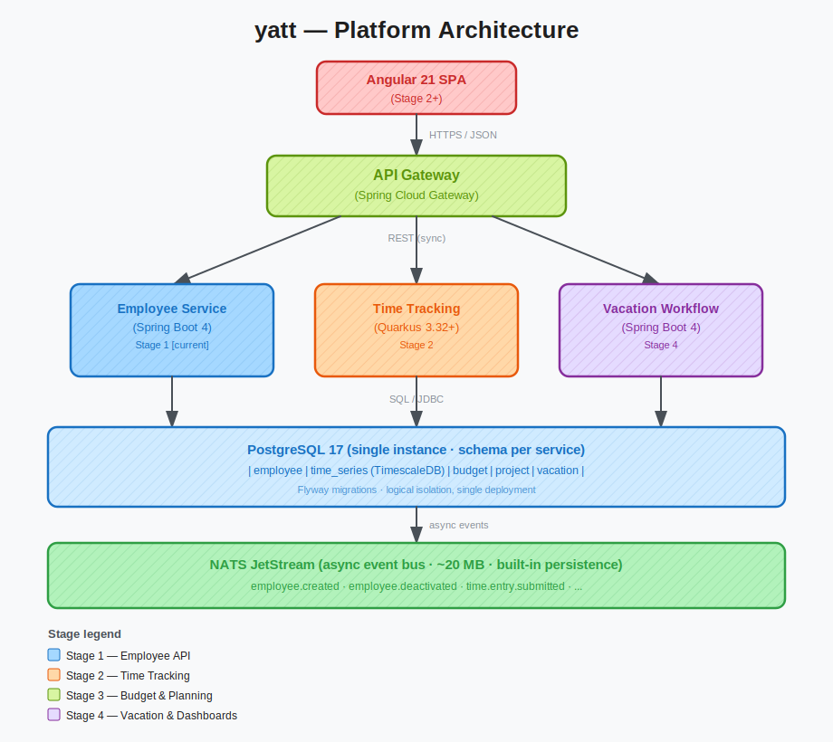

# yatt_ ⏱️

> **Yet Another Time Tracker** — because the world definitely needed another one.

A full-stack, microservices-based time-tracking, project-planning, and vacation-workflow platform — built from scratch as a Java learning project. The secondary goal is to produce something genuinely useful. The primary goal is to understand *why* things work, not just *that* they work.

---

## 🤔 What is this?

**yatt** is a learning-first engineering project. Every architecture decision has a documented rationale. Every dependency was chosen deliberately. Every service is small enough to understand completely.

It is also, eventually, a real application:

| Module | What it does |
|---|---|
| 👥 **Employee management** | CRUD, org chart, reporting hierarchy |
| ⏰ **Time tracking** | Clock in/out, manual entries, timesheets |
| 💰 **Time budget** | Allocate hours per project/period, track burn-down |
| 📋 **Project planning** | Projects, milestones, task assignment |
| 🏖️ **Vacation workflow** | Leave requests, approval chain, balance tracking |
| 📊 **Dashboards** | Reports, charts, team utilization views |

**Current status: Stage 1 — Employee REST API** 🔨 (in progress)

---

## 🛠️ Tech stack

| Layer | Technology | Why |
|---|---|---|
| ☕ Language | Java 25 | Latest LTS. Virtual threads, records, pattern matching. |
| 🍃 Primary backend | Spring Boot 4.0 | Largest ecosystem, richest learning resources, best job-market coverage. |
| ⚡ Secondary backend | Quarkus 3.32+ | Fast startup, low memory — used for the time-tracking ingestion service. One project, two frameworks. |
| 🅰️ Frontend | Angular 21 | Standalone components, signals, type-safe templates. |
| 🐘 Database | PostgreSQL 17 + TimescaleDB | Relational for most things. TimescaleDB extension for time-series clock events. |
| 📨 Message broker | NATS JetStream | Lightweight (~20 MB), simple ops, built-in persistence. Kafka would be overkill. |
| 🛤️ Schema migrations | Flyway | Versioned SQL migrations, one source of truth for schema. |
| 🐳 Containers | Docker Compose | Fast iteration on a single machine. Kubernetes deferred until there's an actual reason. |

---

## 🏗️ Architecture



Each service is independently deployable and owns its schema. Services talk synchronously via REST (user-initiated requests) and asynchronously via NATS events (domain events like `employee.deactivated`).

### 🧠 The decisions that were actually hard

🍃 **Spring Boot vs. Quarkus** — Spring Boot won on ecosystem size, learning resources, and job-market breadth. Quarkus is used for the time-tracking service specifically because it is high-throughput and low-logic: a perfect fit for Quarkus's native-image, low-memory profile. One codebase, two frameworks, no artificial constraints.

🐘 **Single PostgreSQL vs. one DB per service** — One instance with schema isolation. A separate database per service is the pure microservices approach, but the operational overhead (backups, connections, local dev complexity) is not worth it at this scale. The schema boundary gives logical isolation without the ops pain.

📨 **NATS vs. Kafka** — Kafka is the industry standard for event streaming at scale. NATS is the right answer when your broker needs to fit in 20 MB of RAM and start in milliseconds. The throughput requirements here do not justify ZooKeeper.

🐳 **Docker Compose vs. Kubernetes** — Kubernetes is not a learning project; it is a full-time job. Compose runs everything on one machine with one command. The architecture is K8s-ready when the time comes.

---

## 📁 Repository structure

```
yatt/
├── 🍃 employee-service/       # Spring Boot 4 — Stage 1 service
│   ├── src/main/java/
│   │   └── com/timetracker/employee/
│   │       ├── Employee.java              # JPA entity
│   │       ├── EmployeeRepository.java    # Spring Data JPA
│   │       ├── EmployeeService.java       # business logic
│   │       ├── EmployeeController.java    # REST endpoints
│   │       ├── EmployeeMapper.java        # entity ↔ DTO
│   │       ├── dto/                       # request & response records
│   │       └── exception/                 # domain exceptions
│   └── src/main/resources/
│       ├── db/migration/                  # Flyway SQL migrations
│       └── application*.yaml             # profile configs
├── 📚 docs/
│   ├── api/                   # OpenAPI 3.1 spec
│   ├── stories/               # user stories by stage
│   ├── tasks/                 # implementation task files
│   ├── diagrams/              # Excalidraw architecture diagrams
│   ├── PRD.md                 # product requirements
│   ├── DESIGN.md              # architecture decisions
│   ├── GUIDELINES.md          # coding standards
│   └── AGENT.md               # AI assistant configuration
├── 🎓 learning-portal/        # Angular 21 learning companion (see below)
├── 🐳 docker-compose.yaml     # base compose (all services)
└── 🐳 docker-compose.dev.yaml # dev overlay (exposes ports)
```

---

## 🚀 Running it

```bash
# 1. Start PostgreSQL
docker compose -f docker-compose.yaml -f docker-compose.dev.yaml up -d

# 2. Run the employee service (dev profile)
cd employee-service
JAVA_HOME="C:/Program Files/Eclipse Adoptium/jdk-25.0.2.10-hotspot" \
  ./mvnw spring-boot:run -Dspring-boot.run.profiles=dev

# 3. Verify
curl http://localhost:8080/actuator/health
# → {"status":"UP"}  🎉
```

---

## 🎓 The learning portal

```
learning-portal/
```

A companion Angular app for working through the implementation. Not a tutorial you read — a guide you follow while building the actual thing.

**Why does this exist?** Because reading about `@Entity` and writing `@Entity` are two completely different experiences. The portal bridges them.

Every one of the **14 Stage 1 stories** (50 tasks) is broken down into:

- 📖 **Plain-English descriptions** — "What is this? Why does it exist? What does Spring do for you automatically?" No assumed knowledge.
- 💡 **Key Concepts** — 4–6 terms defined from scratch before any code appears. `FetchType.LAZY`, `@ControllerAdvice`, `JPA Specification` — all explained as if you've never seen them.
- 💻 **Annotated code examples** — every annotation, every method call, every non-obvious line has an inline comment. Not `// save entity` but `// Hibernate checks if id is null → INSERT; or has a value → UPDATE`.
- ✅ **Clickable checklist** — progress is tracked in localStorage. Close the tab, come back tomorrow, continue exactly where you left off.

```bash
cd learning-portal
npx ng serve
# → http://localhost:4200  🎓
```

---

## 🗺️ Stage roadmap

| Stage | Focus | Status |
|---|---|---|
| **1** | 👥 Employee REST API — CRUD, search, org chart, Docker, integration tests | 🔨 In progress |
| **2** | ⏰ Time tracking (Quarkus), API Gateway, Angular frontend shell | 📋 Planned |
| **3** | 💰 Time budget service, 📋 project planning service | 📋 Planned |
| **4** | 🏖️ Vacation workflow, 📊 dashboards, observability stack | 📋 Planned |

---

## 🧑‍🎓 What "learning-first" actually means

- 📝 Every decision is documented with pros, cons, and the reason chosen — not just the outcome.
- 🐢 Understanding takes priority over speed. If something works but you cannot explain why, it does not count.
- 🪜 The codebase evolves incrementally. Stage 2 infrastructure does not appear until Stage 2.
- 🧪 Tests are not an afterthought. The employee service has unit tests (Mockito), integration tests (Testcontainers + real PostgreSQL), and the API is defined in OpenAPI before a single controller is written.

---

## 📐 Conventions

📏 Code conventions, package structure, testing strategy, and dependency rules → [`docs/GUIDELINES.md`](docs/GUIDELINES.md)

🔄 Development workflow (story lifecycle, task structure, commit conventions) → [`docs/PROCESS.md`](docs/PROCESS.md)

🧠 Architectural decisions with trade-off analysis → [`docs/DESIGN.md`](docs/DESIGN.md)
